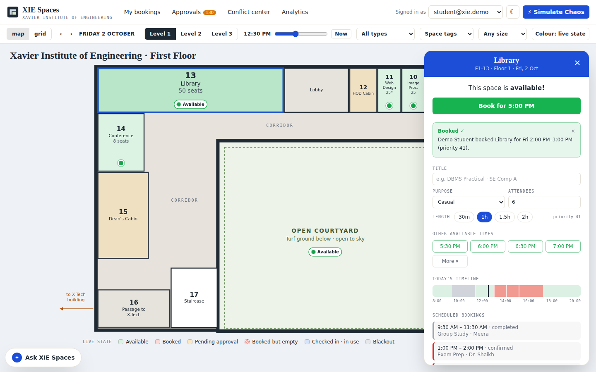
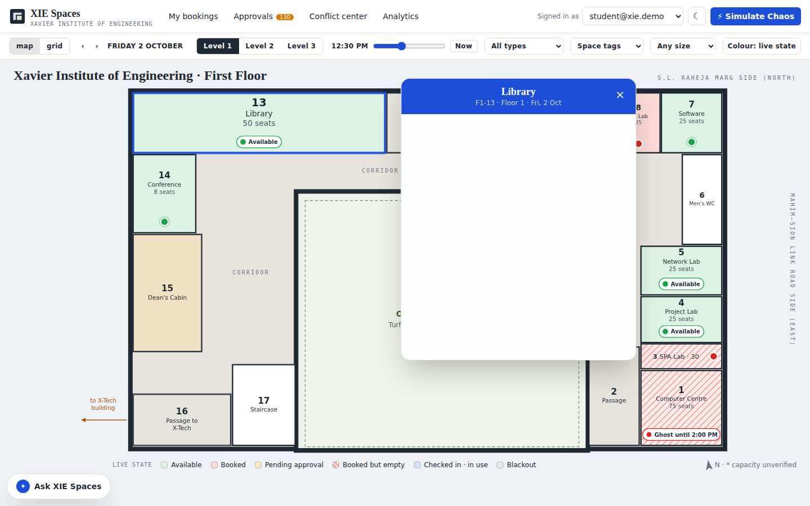
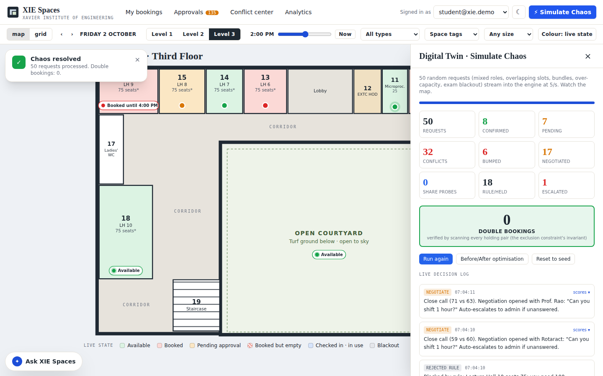
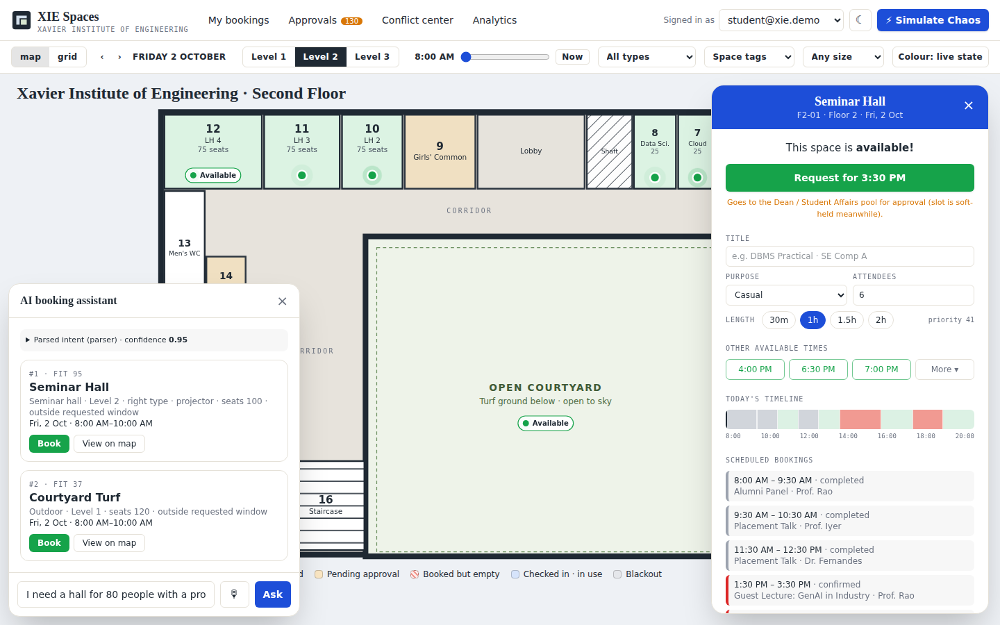

# XIE Spaces

Campus resource booking and conflict resolution for **Xavier Institute of Engineering** (Mahim, Mumbai). It has a Skedda-style live map of all three floors, a vacancy button on every bookable room, GSAP Flip card morphing, and a conflict engine that explains its decisions.



```bash
npm install
npm run dev      # http://localhost:3000
npm test         # engine + QR tests, incl. the 200-parallel double-booking test

# optional services
npm run solver   # OR-Tools CP-SAT + forecast (FastAPI, port 8080), then set SOLVER_URL
npm run mcp      # MCP server over stdio
npm run bot      # Telegram bot (needs TELEGRAM_BOT_TOKEN)
cd solver && python -m pytest   # solver tests
```

| Route | Screen |
| --- | --- |
| `/` | Landing: the satellite footprint draws in and morphs into the plan outline (MorphSVG), then ScrollTrigger explodes the three floors into an isometric stack. Click a floor to open it. |
| `/map` | Live campus map (`?floor=2` deep-links a level) |
| `/swipe` | Resource Tinder (mobile-first): swipe right to book, left to skip, up to save, with vibe filters. The card morphs into the confirmation sheet. Installable as a PWA. |

## What's in this build

| Area | Status |
| --- | --- |
| 3 hardcoded SVG floor plans, traced from the XIE plans (`src/data/campus.ts`). Every room is a `<path data-room-id="F2-10">`. | ✅ |
| Live state colouring: free, booked, pending, ghost (hatched), checked-in, blackout. Time scrubber, date nav, level tabs, filters. | ✅ |
| Vacancy buttons on each room (pulsing when free; pill shows "In use until 1:00 PM" etc.) | ✅ |
| **GSAP Flip card morph**: the room shape expands into the booking card and collapses back into the room on close | ✅ |
| Skedda-style card: "Book for 1:30 PM", other available times, timeline, scheduled bookings, mini-plan visual, tags | ✅ |
| Grid view (rooms × hours) | ✅ |
| Booking engine: rules gate, priority scoring, bump, negotiate, share probe, least-disruption alternatives, waitlist auto-promotion | ✅ |
| Auto-approval tiers, approver console with SLA timers and escalation | ✅ |
| QR check-in (rotating 60 s token), no-show auto-release, release early, `.ics` export | ✅ (simulated scan) |
| AI assistant: text and voice (Web Speech API), Zod-validated `BookingIntent`, ranked option cards | ✅ (Claude if `ANTHROPIC_API_KEY` is set, otherwise a deterministic parser) |
| Digital Twin **Simulate Chaos**: 50 requests at 5/s, live decision log, counters, double bookings = 0, before/after, reset | ✅ |
| Analytics: utilisation heatmap, ghost-booking rate, solar vs load, club leaderboard | ✅ (basic) |
| Supabase schema with `EXCLUDE USING gist` constraint, RLS, and `book_resources` RPC (`supabase/migrations/0001_init.sql`) | ✅ written, not wired |
| Landing hero (MorphSVG + ScrollTrigger exploded isometric floors) | ✅ |
| Resource Tinder `/swipe` (`@use-gesture/react` + GSAP Flip) | ✅ |
| PWA: manifest, offline service worker, Web Push handler | ✅ (push needs a VAPID sender) |
| Signed rotating QR: HS256, 60 s TTL, per-room secret (`/api/qr`) | ✅ |
| Live occupancy ingestion `POST /api/occupancy` | ✅ (in-memory) |
| FastAPI + OR-Tools CP-SAT auto-scheduler `POST /solver/schedule` (no overlaps, capacity/type/tags, faculty availability, no back-to-back across floors; minimises moves and floor travel) and `/forecast` | ✅ wired into Before/After optimisation |
| MCP server: `search_availability`, `create_booking`, `explain_decision` | ✅ |
| Telegram bot (grammY), WhatsApp Cloud API webhook | ✅ (need tokens) |

## Supabase setup

Without Supabase env vars the app runs entirely in the browser (demo mode). With them it switches to the real backend. Every write goes through `/api/engine`, which runs the same engine server-side, takes the caller's role from `profiles` (never from the request), and persists through `apply_engine_changes()`. That function is one transaction guarded by the `EXCLUDE` constraint, and on `23P01` the server reloads and decides again. Supabase Realtime recolours every open map.

1. Copy `.env.example` to `.env.local` and fill in the keys.
2. Create the schema in **one** of two ways: paste `supabase/migrations/0001_init.sql` into the Supabase SQL Editor, or set `SUPABASE_DB_URL` and run `npm run db:migrate`.
3. Run `npm run db:seed`. This loads the rooms, two weeks of bookings and the exam blackout, and creates the four `@xie.demo` accounts (password: `DEMO_PASSWORD`).
4. Run `npm run dev` and sign in.

`tests/db.test.ts` runs the real migration in PGlite (Postgres in WASM) and drives the server write path against it. It covers the exclusion constraint, 200 concurrent bookings, atomic bumps, role checks, and no-show with waitlist promotion.

### Deviations from the master prompt (flagged)

The prompt asked me to check before deviating from the stack. These are the shortcuts I took to get a working demo in the time available:

1. **Rules run in the Next.js server, not inside a Postgres RPC.** The engine runs in TypeScript on the server, and Postgres enforces atomicity and the no-overlap guarantee. Without Supabase env vars, everything runs in the browser instead (`localStorage`, with `BroadcastChannel` standing in for Realtime).
2. **No shadcn/ui, TanStack Query, Inngest or Upstash yet.** Escalation SLAs are compressed to minutes for the demo. The forecast is a weekday-seasonal baseline with a trend term, not LightGBM/Prophet. The MCP server, Telegram bot and WhatsApp webhook each run their own seeded engine until Supabase is wired.
3. **Times are stored as date plus minutes in Asia/Kolkata**, not `timestamptz` (the SQL uses `timestamptz`).
4. **Auth** is Supabase email/password with the four seeded `@xie.demo` accounts. In demo mode (no env vars), a role switcher stands in for it.

### Assumptions

- Capacities marked "assumed" in the brief are seeded with `capacityVerified: false`. They show a `*` on the map and an "unverified" chip on the card. These are: F1-11 Web Design (25), F3-01 AutoCAD (40), F3-02 Tutorial 3 (20), and F3-13/14/15/16/18 LH 6–10 (75 each). The Courtyard Turf (120) is also unverified.
- Floor 1 "18 Women's WC" is listed in the brief but does not appear on the plan, so it is not drawn.
- Approval pools: Floor 1–2 labs go to the Computer HOD, Floor 3 labs to the EXTC HOD, Seminar Hall and courtyard to Dean / Student Affairs, and lecture halls to the Academic Office.
- Exam blackout: the second-floor lecture halls and Seminar Hall are reserved for exams from 09:00 to 13:00, two days after today.

## How conflict scoring works

```
score = 0.40·purpose + 0.20·role + 0.15·urgency + 0.15·fairness_boost + 0.10·usage_history
purpose: exam 100 > academic class 80 > faculty event 60 > club event 40 > casual 20
```

- Incoming beats the holder by ≥ 15: **bump**. The loser gets a plain-English explanation and rebooking offers, and the fairness ledger is updated.
- Within 15: **negotiation** ("Can you shift 1 hour?").
- Both fit in the room: **share probe**.
- Otherwise: rejected, with the 3 least-disruption **alternatives**: same room at the nearest slot, a similar room (type, tags, floor distance), or the adjacent time.
- A user or club bumped 3 or more times gets a fairness boost.

## Architecture

```
FloorMap (SVG) ──click──► RoomCard (GSAP Flip morph)
      ▲                         │ book()
      │ live state              ▼
 zustand store ◄──────── engine.bookResources(req)
  (localStorage +            rules → score → insertGuarded (23P01) → bump/negotiate/share/alternatives
   BroadcastChannel)
      ▲
 Assistant ──POST /api/assistant──► Claude tool-use (or parser) ──► Zod BookingIntent ──► searchAvailability
```

## 3-minute demo script

1. **Map.** Switch levels and drag the time scrubber. Click Library: the room morphs into the card. Press "Book for …".
2. **AI booking.** Open "Ask XIE Spaces" and choose "hall for 80 people with a projector this Friday evening". The Seminar Hall ranks first. Book it.
3. **Conflict and bump.** As student, book LH 2 for a club event. Switch to admin and book the same slot with purpose Exam. The card shows the bump with score bars. Open Conflict center to see the log and the fairness ledger.
4. **QR no-show.** Open My bookings, then Simulate no-show. The slot is released and the waitlist is promoted.
5. **Simulate Chaos.** 50 requests run live, ending with **0 double bookings**. Then run Before/After optimisation and Reset.
6. **Analytics.** Shows the heatmap, solar vs load, and the leaderboard.

| Flip morph (mid-flight) | Simulate Chaos | AI assistant |
| --- | --- | --- |
|  |  |  |
